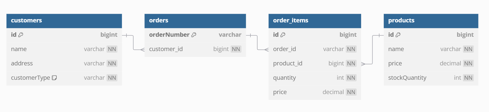

# 📦 WMS 스쿼드 백엔드(풀스택) 개발자 사전과제

## 🚀 프로젝트 개요
이 프로젝트는 **주문 등록 및 엑셀 업로드를 통한 주문 등록 API**를 제공하는 Spring Boot 기반의 백엔드 애플리케이션입니다.
고객이 상품을 주문할 수 있으며, **엑셀 업로드를 통한 대량 주문 등록 기능**이 포함되어 있습니다.
또한, **동시 주문 충돌을 방지하기 위해 Pessimistic Lock을 적용**하였습니다.

---

## 🔧 기술 스택
- 🟢 **언어**: Java 17
- 🚀 **프레임워크**: Spring Boot 3.3.1
- 🛠 **데이터베이스**: H2 (인메모리 DB)
- 💾 **ORM**: JPA (Spring Data JPA)
- 🔧 **빌드 도구**: Gradle
- 📊 **엑셀 처리**: Apache POI
- 📌 **빌드 및 검증 도구**: Lombok

---

## 📂 프로젝트 구조
```plaintext
order-api
│── src
│   ├── main
│   │   ├── java/co/kr/timfresh/orderapi
│   │   │   ├── controller     # API 컨트롤러 (OrderController)
│   │   │   ├── service        # 비즈니스 로직 (OrderService, OrderExcelService)
│   │   │   ├── repository     # JPA 리포지토리 (OrderRepository, ProductRepository 등)
│   │   │   ├── entity         # JPA 엔티티 (Order, Product, Customer 등)
│   │   │   ├── dto            # DTO 객체 (OrderRequestDto, OrderResponseDto 등)
│   │   │   ├── exception      # 예외 처리 (GlobalExceptionHandler)
│   │   │   ├── strategy       # 가격 전략 패턴 (PriceStrategy, PriceStrategyFactory)
│   │   │   ├── util           # 유틸리티 (OrderNumberGenerator)
│── README.md
│── build.gradle
│── application.yml
```

---

## 📌 사용한 외부 라이브러리 및 오픈소스
| 라이브러리 | 버전 | 사용 목적 |
|------------|------|----------|
| `org.apache.poi:poi` | 5.2.3 | 엑셀 파일(.xls) 처리 |
| `org.apache.poi:poi-ooxml` | 5.2.3 | 엑셀 파일(.xlsx) 처리 |
| `org.springframework.boot:spring-boot-starter-web` | 최신 안정 버전 | 웹 API 개발 |
| `org.springframework.boot:spring-boot-starter-data-jpa` | 최신 안정 버전 | JPA ORM 사용 |
| `org.springframework.boot:spring-boot-starter-validation` | 2.7.18-SNAPSHOT | 입력 값 검증 |
| `com.h2database:h2` | 최신 안정 버전 | 인메모리 데이터베이스 |
| `org.projectlombok:lombok` | 최신 안정 버전 | 코드 간소화 (Getter, Setter, Constructor 자동 생성) |
| `org.springframework.boot:spring-boot-starter-test` | 최신 안정 버전 | 단위 및 통합 테스트 |
| `org.junit.platform:junit-platform-launcher` | 최신 안정 버전 | 테스트 실행 |

---

## 📌 API 명세
### 🛒 1️⃣ 주문 생성 (단건)
#### ✅ 요청 (POST `/api/v1/orders`)
```json
{
  "customerId": 1,
  "orderItems": [
    {
      "productId": 101,
      "quantity": 2
    }
  ]
}
```
#### ✅ 응답 (201 Created)
```json
{
  "orderNumber": "20240222-145623-987-AB12CD34EF56",
  "customerName": "홍길동",
  "customerAddress": "서울시 강남구",
  "orderItems": [
    {
      "productId": 101,
      "quantity": 2,
      "price": 20000
    }
  ]
}
```

---

### 📥 2️⃣ 엑셀 주문 등록
#### ✅ 요청 (POST `/api/v1/orders/upload`)
- **요청 형식**: Multipart File (엑셀 파일 업로드)
#### ✅ 응답 (201 Created)
```json
[
  {
    "orderNumber": "20240222-145623-987-AB12CD34EF56",
    "customerName": "홍길동",
    "customerAddress": "서울시 강남구",
    "orderItems": [
      {
        "productId": 101,
        "quantity": 2,
        "price": 20000
      }
    ]
  },
  {
    "orderNumber": "20240222-145624-988-XY78GH90IJ12",
    "customerName": "김철수",
    "customerAddress": "서울시 마포구",
    "orderItems": [
      {
        "productId": 102,
        "quantity": 3,
        "price": 30000
      }
    ]
  }
]
```

---

## ▶ 실행 방법
### 1️⃣ 프로젝트 실행
```bash
# Gradle 빌드 및 실행
./gradlew bootRun
```
### 2️⃣ H2 콘솔 접속
- 🌐 브라우저에서 `http://localhost:8080/h2-console`
- 🔗 JDBC URL: `jdbc:h2:mem:testdb`
- 🔑 사용자명: `sa`, 비밀번호: 없음

---

## 🚀 **가점 요소**
### 📌 1️⃣ **재고를 고려한 설계**
- 주문 시 **재고 감소 로직 적용**
- 동시 주문 발생 시 **비관적 락을 적용하여 재고 초과 방지**

### 📌 2️⃣ **테스트 코드 작성 (단위 및 통합 테스트 포함)**
- 주문 생성, 재고 관리, 예외 발생 시나리오를 검증하는 **단위 테스트 및 통합 테스트 작성**
- **멀티스레딩 환경에서 동시 주문을 검증하는 테스트 코드 추가**
- **MockMultipartFile을 활용한 엑셀 업로드 테스트 포함**

### 📌 3️⃣ **확장성을 고려한 코드**
- 가격 정책을 유연하게 적용하기 위해 **전략 패턴 (Strategy Pattern)** 적용
- `PriceStrategy` 인터페이스를 활용하여 **고객 유형별 가격 할인 로직** 분리
- **VIP 고객과 일반 고객의 가격 정책이 다르게 적용됨**

### 📌 4️⃣ **ERD**


---


